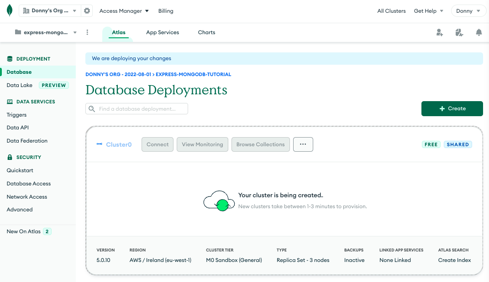

### Building REST API with Express and Mongoose
This step by step tutorial was developed referencing the following resources:
[mdn_web docs](https://developer.mozilla.org/en-US/docs/Learn/Server-side/Express_Nodejs/routes) & [rahmanfadhil](https://rahmanfadhil.com/express-rest-api/)


1. Make new project directory. 
```
mkdir <folder_name>
```
2. Change directory into new project folder.
``` 
cd <folder_name>
```
3. Initialise npm and install dependancies.
```
npm init -y
npm i express mongoose dotenv
npm i nodemon --save-dev
```
4. Update package.json file for run scripts.
```
  "scripts": {
    "test": "echo \"Error: no test specified\" && exit 1",
    "start": "node server.js",
    "dev": "nodemon ."
    }
```
5. Make project folder structure and files.
```
mkdir controllers
mkdir models
mkdir routes

touch server.js
touch routes/user.js
touch models/user.model.js
touch controllers/user.controller.js
```
6. Update package.json "main" with new file names.
```
  "main": "server.js",
```
7. Build express server within server.js
```
const express = require("express")
const app = express()
const port = process.env.port || 3000

app.listen(port, () => {
	console.log(`Server running on port: ${port}`)
})
```
8. Confirm server can run.
```
npm run dev
```
Your terminal should confirm your server is running and display port number.

### Creating MongoDB connection.
9. Create free [MongoDB Atlas account](https://account.mongodb.com/account/login)
10. Create a cluster and connect to your cluster via MongoDB's native driver. 





11. Create new .env file to store database application code.
```
touch .env
```
12. Copy and paste the application code into .env file. Replace <username> & <password> with the password you created during projet set-up. 
```
ATLAS_URI = mongodb+srv://<username>:<password>@cluster0.ib7cc.mongodb.net/?retryWrites=true&w=majority
```


Setup Mongoose within server.js file.
```
const mongoose = require('mongoose')
const uri = process.env.ATLAS_URI

mongoose.connect(uri)    
const db = mongoose.connection

app.use(express.json())
```
